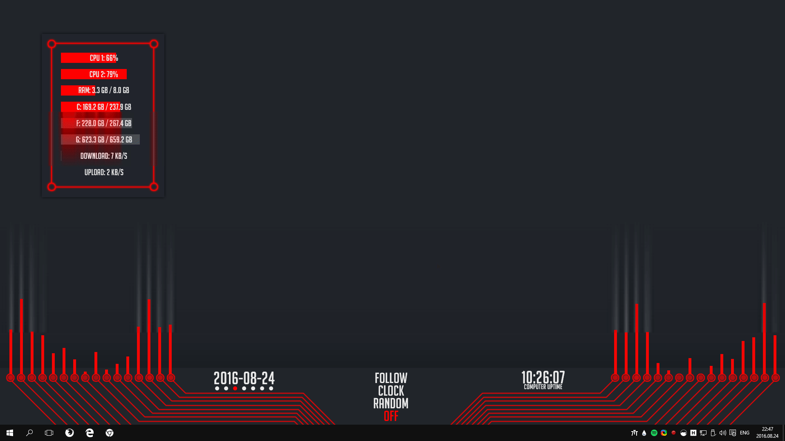
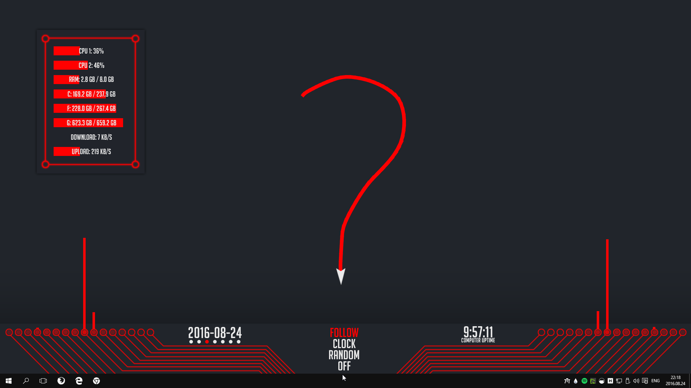
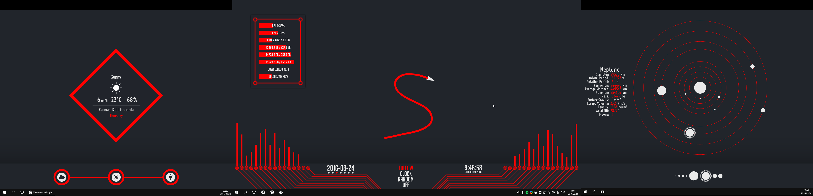
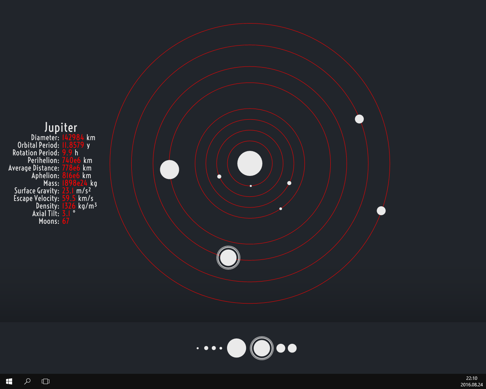
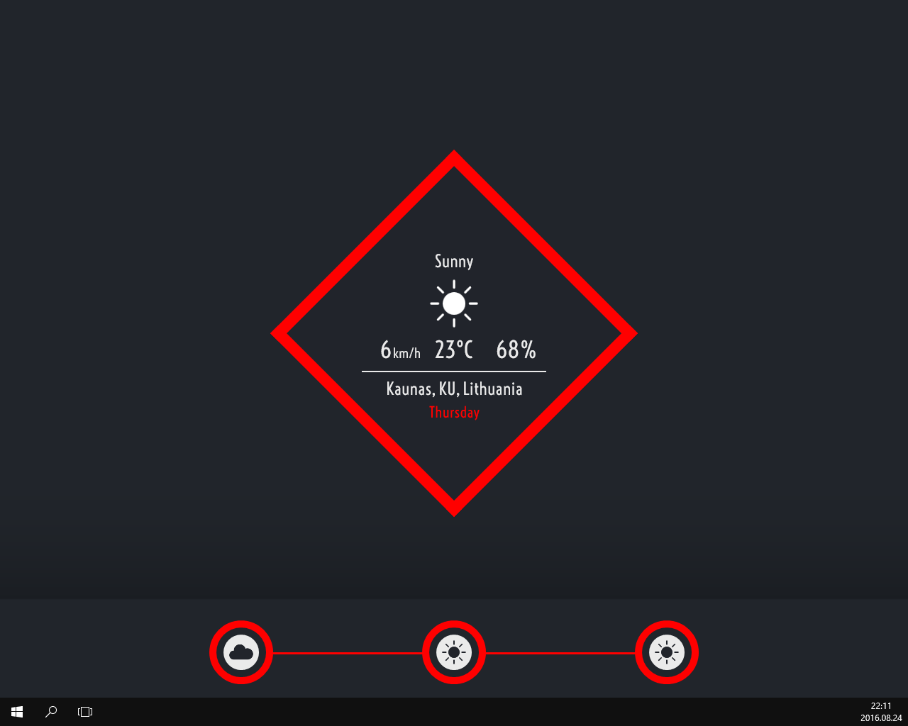
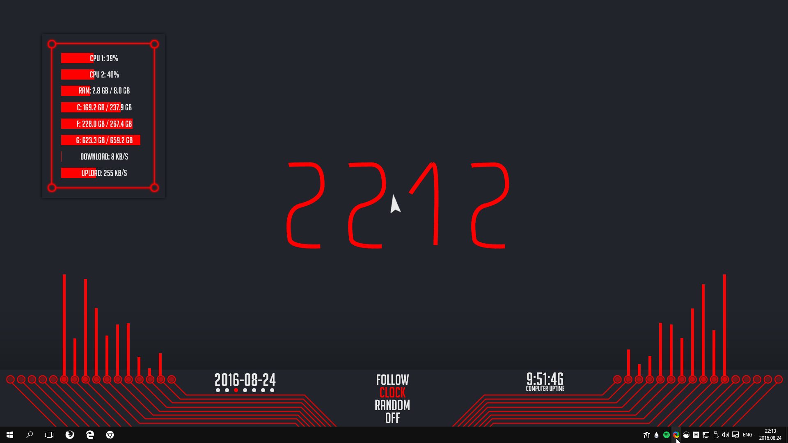

A fancy rainmeter skin with a paper plane which follows the mouse. It also includes a working solar system, music visualizers, a weather widget and other stuff. This project is from 2016, so may not be up to date.

# Showcase  

***










***
# Overview

* Red Paper Plane - a paper plane which follows the mouse, leaving a trail
* Weather - weather display with animations
* Solar System - fairly accurate solar system with current planet alignments
* Reworked Action Center - action center for launching programs and games
* Dot Visualizer - music visualizer
* System Info Box - box showing system specs
* Miscellaneous

***

## Red Paper Plane


This is the main part of the skin, it is a white paper plane which leaves a red trail behind. It has several modes: *FOLLOW*, *CLOCK*, *RANDOM* and *OFF*. Off is self explanatory. Follow is when the paper plane follows the mouse cursor. Clock is drawing the current time. Random just wanders around the desktop in a smooth way.

The skin works by having a focus point, which is defined by `xFocusCoordinate` and `yFocusCoordinate`. The paper plane always aims at this point and depending how far it is from it, it calculates the speed by simply taking the distance from it. Now the rest is to just set the `focusCoordinate` to whatever we want it to be (for example the current mouse position, a specific point and so on). There are 60 smoke meters which follow the plane. Every update the last smoke meter in the chain is moved to the position of the paper plane and it is resized according to the speed of the paper plane (so that there would be no gaps). It rotates all the things with a [transformation matrix](https://docs.rainmeter.net/tips/transformation-matrix-guide/), you can just set the angle for each block after you know how (read the guide linked before).

*Activation: load the toggles.ini file, from it you can launch all the options you can use the plane with.*

***

## Solar System

[The planet positions are reasonably accurate](http://imgur.com/a/UmZvm). They update in real time. Sadly, in my skin all orbits are circles, but in real life they are actually ellipses. This means that planets with more elliptical orbits will be more off than the others. This especially applies to Mercury, it will always be a decent amount off. But oh well. While making this skin it already has moved about an eighth of its orbit, that's pretty cool to watch (Mercury's orbit is 86 Earth days long, I made this skin 10 days ago or so). You can make the planets proportional to each other by opening `\RPP Solar System\PlanetData.inc` and changing the PlanetSizeToScale variable equal to 1 (this doesn't scale the Sun, scaling it would be nonsense because when mercury is 2 px in diameter the sun would be over 550 px in diameter, which is a half of the screen height). I also encourage you to read the comments there, and look at the other variables as well.

A *very* rough description of how it works: I took 2015 Jan 1 as a starting date, then measured each planet's degrees according to the sun taking 0 as straight to the right. This is what the starting angle is. Next is each planet's orbit duration in seconds. To calculate the orbits I take the time since 2015 Jan 1 in seconds and divide it by the orbit duration. This way I get how many orbits the planet has done and I can multiply that number by 360 to get how many degrees I have to move it since Jan 1 2015. I used a [transformation matrix again](https://docs.rainmeter.net/tips/transformation-matrix-guide/) to set them in their place in each orbit. I didn't use a webparser because I didn't find any good place where I could easily get an API for planet positions without having to take an astrophysics course. Also using a webparser would mean it wouldn't work without internet access. I think what I did is a decent alternative.

So this is only semi-accurate in one aspect basically: the position of the planets in their orbits. But I'd argue that you can't really make it more accurate. Let's try to make the orbits proportional in size, let's take Neptune's average distance from the Sun which is 4.495e9 km, let's make this 300 px wide, in that case Mercury's 5.7e7 km orbit would be 78 times smaller than Neptune's, so that's 4 px from the sun on my screen, Earth's would be 12 px away all 4 inner planets would be bunched up so that you could barely tell their orbits apart. Making elliptical orbits would be kind-of possible, by using the transformation matrices again and manipulating the size of the orbits, but then the problem would arise that the planets are faster when they are closer to the Sun, which I don't have any idea how to do properly. Making the planets rotate sounds like something not too hard, in my case, because the planets are white this is luckily avoided, but making the planets actual images instead of pure white is not hard, so this is still an issue. It sounds like it's not too hard to make until you realize that Venus rotates in the wrong direction, but that's okay as well, but then you realize that Uranus rotates 98 degrees from the solar system plane and you just go ?!?!?!??!?! (you would have to store a lot of images so that you could display Uranus' from the ~~north pole~~ solar plane, or create a 3D object and rotate that so yeah^(I might do it at some point, I like challenges...)). Technically the Sun orbits the mass center of the solar system as well and IIRC that mass center is outside of the sun, so that is another inaccuracy. Adding moons would be pretty easy at this point though, but I found it good enough.

This skin also includes a planet information thing, you can press each planet and you see the characteristics about that planet. I originally wanted to make it so that you could press the planets in the actual solar system but that doesn't work because when using a transformation matrix the area where you have to click doesn't change but the actual image does. And also because I would have specify a width for it to register clicks because it is a roundline meter which doesn't register mouse clicks without having set a width and height for that meter which would offset it again... It's complicated to say the least.

*Activation: load the SolarSystem.ini file for the solar system. Optionally you can load the PlanetInformation.ini and PlanetSelectionBar.ini to see information about each planet as well.*

***

## Weather

It started out as an animation, because I really wanted to try to see if it is possible to make nice animations in rainmeter. I'd say that yes, it is possible, not very easy though. I'm very happy with the result, I wanted to add sound to the animation but decided against it because it would be slightly annoying. It displays today's, tomorrow's or the day after tomorrow's weather depending on which icon you press. The icon gives you a preview of what the weather will be.

A *very* rough description of how it works: the skin (specifically the script of the skin) is divided into states, each state does one part of an animation. Every state has an end `if` which sets the next state and counts as an initializer for the next state which is really useful. For the smoothness I use a lot of sine and intermediary-variables which increase each other (like velocity, acceleration, jerk and so on, each increasing each other basically by a bit). Again I use transformation matrices to rotate the parts.

*Activation: load the Weather.ini and the WeatherDisplay.ini. Place the WeatherDisplay.ini in the box where the weather skin animation takes place. This is because I wanted the text to fade after the animation and you can only fade entire skins not meters or meter groups. It looked very bad when they just appeared out of nowhere, so I just added another skin. I might fix this in the future, but it's not so easy.*

***

## Reworked Action Center

When I installed Windows 10 a year ago I liked the action center which you could activate with `windows key + a` but it was sadly entirely useless as it never displayed any kind of information, so I made a game launcher which extends from the right just like the action center. It doesn't have any similarities with the actual action center other than that it is activated with the same hotkey and comes from the right side.

For now you have to launch it with an autohotkey hotkey, I could add a small arrow with which you could launch it in the future if someone is interested in using this. Install [autohotkey](https://autohotkey.com/) and run the `Hotkey.ahk` script in the `\RPP Reworked Action Center\` skin.

Or you can create your own launcher and add this line to it:

```
    LeftMouseUpAction=[!ActivateConfig "RPP Reworked Action Center" "ReworkedActionCenter.ini"][!SetVariable "State" 2 "RPP Reworked Action Center"]
```

*Activation: just press the hotkey if you ran the hotkey file. Or just launch it from another meter. No need to load it because the hotkey loads it.*

***

## Dot Visualizer

A dot visualizer to fill in the spaces created by the wallpaper, they are symmetrical to each other and in sync with the Fountain of Colors skin. 16 Dots.

This one is probably entirely useless to you if you plan to use another wallpaper so I don't suggest installing it if that is the case.

*Activation: Just load both Dots.ini files*

***

## System Info Box + Miscellaneous

The box simply displays system info. The current date and below the date are 7 dots each representing the day of the week. This actually may be the only non cosmetic thing about this skin, I never know what day of the week it is so this helps. And it also has a system uptime, this is mostly because of symmetry with the current date. Same thing with the computer uptime text, just for symmetry with the date.

*Activation: load the Box.ini, Date.ini and Uptime.ini. The box.ini in the todolist folder doesn't have any functionality yet, no need to load it.*

## [Wallpaper 5760x1080](http://imgur.com/a/OuZwy)

***

## **Changing The Color Of Each Skin**

***

It isn't very hard to do, I made it so you can change *most* color variables of the skins in each skin's `@Resources\Variables.inc` folder. After you have done that some things will require you to edit them in an image editing program, but you will only need to apply a color filter:

+ The color of the [wallpaper](http://imgur.com/a/OuZwy)
+ The dot in the dot visualizer which is located in `\RPP Dot Visualizers\@Resources\Activator.png`
+ The system info box in `\RPP Info\@Resources\Box.png`

Now open the variables.inc file in the RPP Weather skin again, there will be three variables WRed, WGreen and WBlue change these to the Red, Green and Blue values respectively (each variable is only one number in this case). The reason why this is so complicated is because when having something like this `SolidColor=255,0,0,(Max(255 - #AfterglowCurrent# * 1000, 0))` I can't figure out how to place the `GlobalSkinColor=255,0,0,255` variable so that I could set the alpha value separately. If someone knows a solution to this please post it.

After you have done all of this press `Refresh all` in rainmeter.

***

## **Other Skins Used**

***

* [Fountain Of Colors](http://alatsombath.deviantart.com/art/Fountain-of-Colors-desktop-music-visualizer-518894563) with [these](http://i.imgur.com/3uvoL7W.png) settings
* [Windows Taskbar Clock](https://www.reddit.com/r/Rainmeter/comments/3fz427/windows_taskbar_clock_for_dual_monitor_setups/)

***

## **Thanks To**

***

* jsmorley for the weather tutorial and many many helpful posts on the forums
* [May-0](https://www.reddit.com/user/May-0) for [this mouse plugin](https://www.reddit.com/r/Rainmeter/comments/3on89q/mouse_position_meter/) with which you can get the current mouse position

**NOTE: You will have to manually install the mouse plugin mentioned above, [here is the link again](https://www.reddit.com/r/Rainmeter/comments/3on89q/mouse_position_meter/). Just copy these two .dll files to this directory `C:\Program Files\Rainmeter\Plugins` I cannot include it in the .rmskin because it only has a 64 bit version but rainmeter wants a 32 and 64 bit version of the plugin.**
